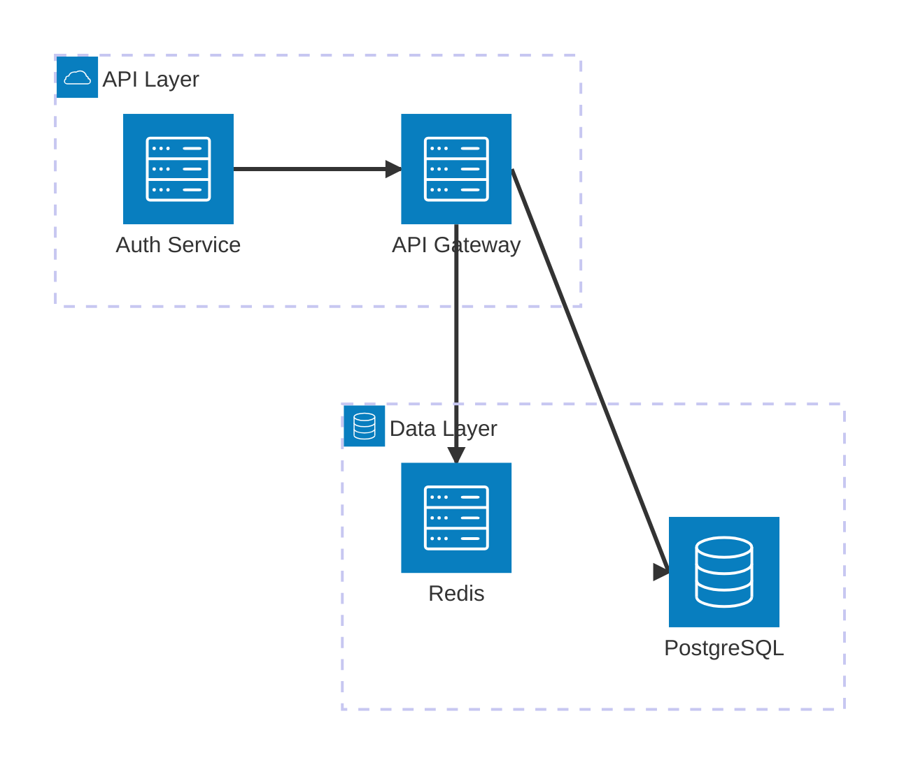
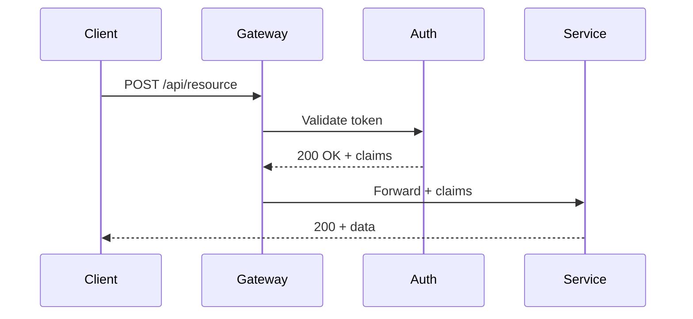
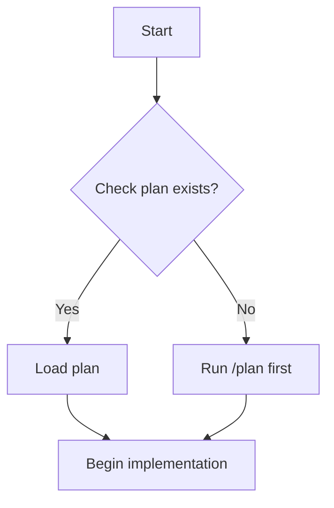
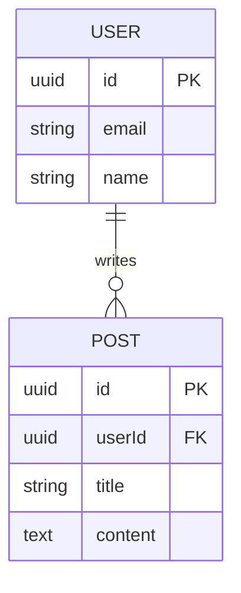
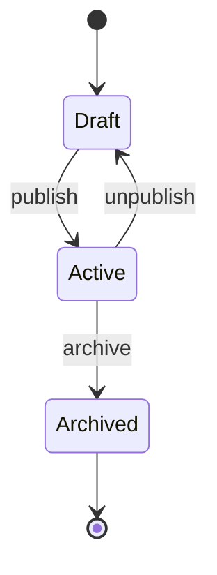

# Mermaid Diagrams

Always wrap output in ` ```mermaid ` code block. Claude renders these inline.

---

## Flags

| Flag | Behavior |
|------|----------|
| *(none)* | Generate Mermaid diagram (current behavior) |
| `--explain <topic>` | ASCII art + Mermaid + prose visual explanation |
| `--ascii <topic>` | Terminal ASCII diagram only (no Mermaid) |
| `--html <topic>` | Self-contained HTML file with diagram + explanation, opens in browser |

## Dispatch

- No flag → generate Mermaid diagram per diagram type selection below
- `--explain` → load `references/explain-mode.md`
- `--ascii` → load `references/ascii-mode.md`
- `--html` → load `references/html-mode.md`

---

## Diagram Type Selection

| Type | When to use | Opening line |
|------|------------|--------------|
| Flowchart | Process flows, decision trees, logic branches | `flowchart TD` |
| Sequence | API calls, event flows, auth handshakes, message passing | `sequenceDiagram` |
| ER | Database schemas, data models, entity relationships | `erDiagram` |
| Class | OOP structure, type hierarchies, interface contracts | `classDiagram` |
| State | Lifecycle models, state machines, status transitions | `stateDiagram-v2` |
| Gantt | Project timelines, phase planning, milestone tracking | `gantt` |
| Architecture | System topology, service mesh, infra layout (v11) | `architecture-beta` |
| User Journey | UX flows, onboarding, step-by-step user paths | `journey` |

---

## Architecture Diagram (v11 — use for system topology)



**Rules:**
- Use `architecture-beta` — NOT `architecture` (old syntax)
- Arrow direction: `service1:R --> L:service2` (right-of-1 connects to left-of-2)
- Icons: `server`, `database`, `cloud`, `disk`, `internet`
- Groups use `group id(icon)[Label]`

---

## Sequence Diagram (for auth/API flows)



**Arrow types:**
- `->>` solid (request/action)
- `-->>` dashed (response/return)
- `-x` with X at end (async, no response expected)

---

## Flowchart (for process/decision trees)



**Direction:** `TD` top-down, `LR` left-right, `RL` right-left, `BT` bottom-top

---

## ER Diagram (for data models)



---

## State Diagram (for lifecycle/status)



---

## Common Errors to Avoid

| Error | Fix |
|-------|-----|
| Labels with spaces crash | Wrap in quotes: `A["My Label"]` |
| `architecture` not rendering | Use `architecture-beta` |
| Arrow direction wrong | Check: `A:R --> L:B` means A's right connects to B's left |
| Sequence arrows broken | Use `->>` not `->` |
| Too many nodes → illegible | Split into 2 diagrams at natural boundary |

**Size rule:** >15 nodes → split. Diagrams should fit on one screen.
