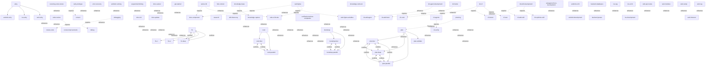

# Skill Dependency Graph

> Auto-generated by `epost-kit verify`. Do not edit manually.

```mermaid
graph TD
  a11y[a11y] --> android_a11y[android-a11y]
  a11y[a11y] --> ios_a11y[ios-a11y]
  a11y[a11y] --> web_a11y[web-a11y]
  bootstrap[bootstrap] ~~~|enhances| bootstrap_fast[bootstrap-fast]
  bootstrap[bootstrap] ~~~|enhances| bootstrap_parallel[bootstrap-parallel]
  bootstrap[bootstrap] --> bootstrap_fast[bootstrap-fast]
  bootstrap_fast[bootstrap-fast] x--x|conflicts| bootstrap_parallel[bootstrap-parallel]
  bootstrap[bootstrap] --> bootstrap_parallel[bootstrap-parallel]
  bootstrap_parallel[bootstrap-parallel] x--x|conflicts| bootstrap_fast[bootstrap-fast]
  code_review[code-review] ~~~|enhances| review_code[review-code]
  code_review[code-review] ~~~|enhances| review_improvements[review-improvements]
  web_prototype[web-prototype] -.->|requires| convert[convert]
  cook[cook] --> cook_fast[cook-fast]
  cook_fast[cook-fast] x--x|conflicts| cook_parallel[cook-parallel]
  cook[cook] --> cook_parallel[cook-parallel]
  cook_parallel[cook-parallel] x--x|conflicts| cook_fast[cook-fast]
  debugging[debugging] -.->|requires| debug[debug]
  debugging[debugging] ~~~|enhances| debug[debug]
  debugging[debugging] ~~~|enhances| fix[fix]
  debugging[debugging] ~~~|enhances| fix_deep[fix-deep]
  debugging[debugging] ~~~|enhances| fix_ci[fix-ci]
  debugging[debugging] ~~~|enhances| fix_ui[fix-ui]
  web_ui_lib[web-ui-lib] -.->|requires| docs_component[docs-component]
  web_figma[web-figma] -.->|requires| docs_component[docs-component]
  docs_seeker[docs-seeker] ~~~|enhances| research[research]
  error_recovery[error-recovery] ~~~|enhances| debugging[debugging]
  fix[fix] ~~~|enhances| fix_deep[fix-deep]
  fix[fix] ~~~|enhances| fix_ci[fix-ci]
  fix[fix] ~~~|enhances| fix_ui[fix-ui]
  fix[fix] x--x|conflicts| fix_deep[fix-deep]
  fix[fix] --> fix_ci[fix-ci]
  fix[fix] --> fix_deep[fix-deep]
  fix_deep[fix-deep] x--x|conflicts| fix[fix]
  fix[fix] --> fix_ui[fix-ui]
  get_started[get-started] ~~~|enhances| docs_init[docs-init]
  get_started[get-started] ~~~|enhances| docs_update[docs-update]
  hub_context[hub-context] ~~~|enhances| skill_discovery[skill-discovery]
  knowledge_base[knowledge-base] -.->|requires| knowledge_capture[knowledge-capture]
  knowledge_retrieval[knowledge-retrieval] ~~~|enhances| research[research]
  knowledge_retrieval[knowledge-retrieval] ~~~|enhances| planning[planning]
  planning[planning] -.->|requires| plan[plan]
  plan[plan] ~~~|enhances| plan_fast[plan-fast]
  plan[plan] ~~~|enhances| plan_deep[plan-deep]
  plan[plan] ~~~|enhances| plan_parallel[plan-parallel]
  plan[plan] ~~~|enhances| plan_validate[plan-validate]
  plan[plan] --> plan_deep[plan-deep]
  plan_deep[plan-deep] x--x|conflicts| plan_fast[plan-fast]
  plan_deep[plan-deep] x--x|conflicts| plan_parallel[plan-parallel]
  plan[plan] --> plan_fast[plan-fast]
  plan_fast[plan-fast] x--x|conflicts| plan_deep[plan-deep]
  plan_fast[plan-fast] x--x|conflicts| plan_parallel[plan-parallel]
  plan[plan] --> plan_parallel[plan-parallel]
  plan_parallel[plan-parallel] x--x|conflicts| plan_fast[plan-fast]
  plan_parallel[plan-parallel] x--x|conflicts| plan_deep[plan-deep]
  plan[plan] --> plan_validate[plan-validate]
  planning[planning] ~~~|enhances| plan[plan]
  planning[planning] ~~~|enhances| plan_fast[plan-fast]
  planning[planning] ~~~|enhances| plan_deep[plan-deep]
  planning[planning] ~~~|enhances| plan_parallel[plan-parallel]
  planning[planning] ~~~|enhances| plan_validate[plan-validate]
  problem_solving[problem-solving] ~~~|enhances| debugging[debugging]
  receiving_code_review[receiving-code-review] ~~~|enhances| code_review[code-review]
  code_review[code-review] -.->|requires| review_code[review-code]
  sequential_thinking[sequential-thinking] ~~~|enhances| debugging[debugging]
  subagent_driven_development[subagent-driven-development] ~~~|enhances| planning[planning]
  verification_before_completion[verification-before-completion] ~~~|enhances| cook[cook]
  verification_before_completion[verification-before-completion] ~~~|enhances| cook_fast[cook-fast]
  verification_before_completion[verification-before-completion] ~~~|enhances| cook_parallel[cook-parallel]
  verification_before_completion[verification-before-completion] ~~~|enhances| fix[fix]
  verification_before_completion[verification-before-completion] ~~~|enhances| fix_deep[fix-deep]
  verification_before_completion[verification-before-completion] ~~~|enhances| plan[plan]
  verification_before_completion[verification-before-completion] ~~~|enhances| plan_fast[plan-fast]
  verification_before_completion[verification-before-completion] ~~~|enhances| plan_deep[plan-deep]
  verification_before_completion[verification-before-completion] ~~~|enhances| plan_parallel[plan-parallel]
  verification_before_completion[verification-before-completion] ~~~|enhances| bootstrap[bootstrap]
  verification_before_completion[verification-before-completion] ~~~|enhances| bootstrap_fast[bootstrap-fast]
  verification_before_completion[verification-before-completion] ~~~|enhances| bootstrap_parallel[bootstrap-parallel]
  web_figma[web-figma] -.->|requires| web_figma_variables[web-figma-variables]
  web_ui_lib[web-ui-lib] -.->|requires| web_ui_lib_dev[web-ui-lib-dev]
  web_figma[web-figma] -.->|requires| web_ui_lib_dev[web-ui-lib-dev]
  kit_cli[kit-cli] -.->|requires| cli_cook[cli-cook]
  kit_cli[kit-cli] -.->|requires| cli_doctor[cli-doctor]
  kit_cli[kit-cli] -.->|requires| cli_test[cli-test]
  kit_agent_development[kit-agent-development] -.->|requires| kit_add_agent[kit-add-agent]
  kit_hooks[kit-hooks] -.->|requires| kit_add_hook[kit-add-hook]
  kit_skill_development[kit-skill-development] -.->|requires| kit_add_skill[kit-add-skill]
  kit_agent_development[kit-agent-development] ~~~|enhances| kit_agents[kit-agents]
  kit_hooks[kit-hooks] ~~~|enhances| kit_agents[kit-agents]
  kit_skill_development[kit-skill-development] -.->|requires| kit_optimize_skill[kit-optimize-skill]
  kit_skill_development[kit-skill-development] ~~~|enhances| kit_agents[kit-agents]
  kit_agents[kit-agents] -.->|requires| kit_verify[kit-verify]
  android_ui_lib[android-ui-lib] ~~~|enhances| android_development[android-development]
  backend_databases[backend-databases] ~~~|enhances| backend_javaee[backend-javaee]
  ios_rag[ios-rag] ~~~|enhances| ios_development[ios-development]
  ios_ui_lib[ios-ui-lib] ~~~|enhances| ios_development[ios-development]
  web_api_routes[web-api-routes] ~~~|enhances| web_frontend[web-frontend]
  web_modules[web-modules] ~~~|enhances| web_frontend[web-frontend]
  web_nextjs[web-nextjs] ~~~|enhances| web_frontend[web-frontend]
  web_prototype[web-prototype] ~~~|enhances| convert[convert]
  web_rag[web-rag] ~~~|enhances| web_frontend[web-frontend]
```

## Stats

- **Skills**: 96
- **Extends**: 14
- **Requires**: 18
- **Conflicts**: 12
- **Enhances**: 56
