# Research: Visualizing the Self-Evolving AI Agent Skill Loop

**Date**: 2026-03-23
**Agent**: epost-researcher
**Scope**: Presentation visualization patterns for self-improving feedback loops in multi-agent systems
**Status**: ACTIONABLE

---

## Research Question

How to effectively visualize and present the "Self-Evolving AI Agent Skill Loop" to mixed technical/non-technical audiences at scale? What diagram metaphor communicates "self-improving over iterations" most intuitively, and how should it be structured for a 30-second slide comprehension?

---

## Executive Summary

The Self-Evolving Skill Loop is best visualized as a **spiral with expanding radius**, not a flat circle. This metaphor communicates growth and learning visually. For presentation:

- **Best metaphor**: Spiral (Nonaka Knowledge Spiral + Boehm Spiral Model hybrid)
- **Best diagram format**: Vertical timeline with feedback arrows + annotated skill layers
- **Best name**: "Adaptive Skill Loop" or "Iterative Mastery Cycle"
- **Slides needed**: 3 slides minimum (overview, detail, comparison)
- **Key differentiator**: Emphasize skill discovery + quality-gating (what makes it self-evolving)

---

## Methodology

| Source | Coverage | Found |
|--------|----------|-------|
| **PDCA/OODA Research** | Deming Wheel vs Boyd Loop comparison | Documented feedback loop frameworks |
| **NVIDIA Data Flywheel** | Self-improving AI agent systems | Iterative refinement patterns |
| **Anthropic Agent Skills** | Native skill discovery mechanics | Discovery timing & async loading |
| **Spiral Model (Boehm)** | Visual expansion metaphor | Risk-driven iteration with growing radius |
| **Nonaka Knowledge Spiral** | Organizational learning cycles | Tacit→explicit knowledge conversion |
| **Mermaid / Visualization** | Tool limitations & best practices | Circular diagrams render poorly; timeline works better |

---

## Key Findings

### 1. Best Visual Metaphor: The Spiral (Not Flat Circle)

**Why Spiral > Circular Loop:**
- **Flat circle** = repeats endlessly at same level (looks mechanical, not intelligent)
- **Spiral** = shows cumulative progress, each iteration richer than the last
- **Expanding radius** = communicates "smarter over time" in 2 seconds

**Precedents:**
- **Nonaka-Takeuchi Knowledge Spiral**: Shows how tacit knowledge becomes explicit through organizational learning cycles
- **Boehm Spiral Model** (software engineering): Expanding radius = cumulative project cost; angular position = phase progress
- **NVIDIA Data Flywheel**: Iteration N produces better models than N-1; each loop feeds back into training

**Result**: Audience instantly sees growth, not repetition.

### 2. Diagram Format: Vertical Timeline + Stacked Feedback Rings

**Mermaid Limitation Found**: Circular flowcharts render poorly in Mermaid. GitHub issue #3228 confirms this is a known limitation. Workaround: Use vertical timeline format instead.

**Recommended Format**: Vertical timeline with 4-5 "iterations" stacked, each showing:
- Layer 1 (left): Prompt/Task input
- Layer 2: Agent routing → Skill discovery
- Layer 3: Execution (reasoning, planning, tools)
- Layer 4 (right): Results → Audit → Feedback

Between iterations: Arrow loop showing **quality gate** (feedback prevents bad loops)

**Why This Works:**
- Reads top-to-bottom (natural reading direction)
- Stacked iterations show cumulative growth
- Rightmost feedback loop visible at glance
- Expandable: Zoom into any iteration for detail
- Non-technical audiences: Looks like a learning process they recognize

### 3. Naming Recommendation: "Adaptive Skill Loop"

| Option | Audience | Problem |
|--------|----------|---------|
| Self-Evolving Skill Loop | All | "Self-evolving" is jargon; implies AI autonomy (risky framing) |
| **Adaptive Skill Loop** | All | ✓ Neutral, positive, familiar term |
| Knowledge Flywheel | Technical | Assumes AI/ML background |
| Intelligent Agent Cycle | Product | Vague; all agents are intelligent |
| Iterative Mastery Cycle | Non-tech | ✓ Emotional resonance; feels like learning |

**Recommended**: Lead with **"Adaptive Skill Loop"** (formal), secondary headline: **"How the System Learns"** (emotional)

### 4. Unique Differentiator: Skill Discovery + Quality Gates

What makes this loop **self-evolving** (not just self-repeating)?

**Three key features to highlight visually:**

1. **Skill Discovery**: Agent finds its own guidance at runtime (not hardcoded)
   - Visual: Magnifying glass or book icon + arrow from agent to skill-index
   - Caption: "Auto-discovers 67+ skills based on task"

2. **Quality Gating**: Output only advances if audit passes
   - Visual: Gate/checkpoint symbol between audit and update
   - Caption: "Blocks low-quality iterations"

3. **Persistent Learning**: Failed iterations improve the next cycle
   - Visual: Skill library grows frame-by-frame across iterations
   - Caption: "Skills + agents + docs evolve each cycle"

**Why This Matters for Slides**: Non-technical audience needs to understand *why* this isn't just "a feedback loop" but *intelligent* feedback. These three features answer that.

### 5. Slide Structure (3-Slide Minimum)

**Slide 1: The Loop (30 seconds)**
- Title: "How Our System Adapts"
- Diagram: Simple vertical timeline, 2 iterations shown (lightweight)
- Caption: "Each task makes the system smarter"
- Subtext: "Skill discovery + quality gates + persistent learning"

**Slide 2: Inside One Iteration (45 seconds)**
- Title: "Anatomy of an Iteration"
- Diagram: Detailed single-iteration flow
- Layers: Task → Agent → Skills → Reason → Execute → Audit → Update
- Call out: Show skill discovery moment (agent scanning skill-index)
- Call out: Show quality gate blocking bad output

**Slide 3: Progress Over Time (60 seconds)**
- Title: "Growing Smarter: Iterations 1 vs 10 vs 100"
- Three stacked mini-spirals showing:
  - Iteration 1: 3 skills available, basic reasoning
  - Iteration 10: 25 skills, refined patterns documented
  - Iteration 100: 67 skills, rich domain knowledge in docs
- Visual: Skill library (left side) visibly grows
- Caption: "System compounds knowledge across iterations"

**Optional Slide 4: Real Example (if time)**
- Show actual task: "Audit epost-agent-kit codebase"
- Walk through 1 full iteration with real skill names (audit, debug, knowledge-retrieval, etc.)
- Show actual output: skill-index → selected skills → execution → report
- Audience sees it's real, not theoretical

### 6. Non-Technical Analogy: Muscle Memory Through Practice

**Pitch to executives:**

> "Imagine a musician learning a difficult piece. First pass: sheet music + basic technique. Tenth pass: muscle memory, confidence, interpretation. Hundredth pass: mastery, own style, teaches others.
>
> Our system works the same way. Each task builds skill memory. Failed attempts teach the system what NOT to do. By iteration 100, it's not just executing tasks—it's evolved domain expertise specific to your codebase."

**Why This Works:**
- Everyone has felt skill mastery (sports, music, coding, writing)
- Non-technical person feels like "they get it"
- Bridges AI/ML terminology gap
- Emotional: "mastery" resonates better than "optimization"

### 7. Differentiation from Standard Agent Loops

**Standard ReAct Loop** (Observation → Thought → Action):
- Repeats same process infinitely
- No persistent knowledge between tasks
- Good for: Single task, in-context problem solving

**Standard PDCA/OODA Loop**:
- Focused on operational problem-solving
- Assumes human planning & approval
- Quality-gating is manual

**epost_agent_kit Self-Evolving Loop** (UNIQUE):
- ✓ Skill discovery (learns what capabilities exist)
- ✓ Quality-gating (audit blocks bad iterations)
- ✓ Persistent knowledge (skills, agents, docs updated)
- ✓ Multi-platform (iOS, Android, Web, Backend simultaneously)
- ✓ Domain-aware (B2B/B2C knowledge evolves in parallel)

**Visual Slide**: Side-by-side comparison table or 3-panel diagram showing:
- Panel A (left): ReAct (repeating arrows, no growth)
- Panel B (center): PDCA (4-step, human-gated)
- Panel C (right): Adaptive Skill Loop (spiral, auto-gated, knowledge accumulation)

---

## Draft Diagrams

### Diagram Option 1: Vertical Timeline (Mermaid - RECOMMENDED)

```mermaid
graph TD
    iter1["<b>Iteration 1</b><br/>Input: Audit codebase"]
    agent1["🤖 Agent<br/>route task"]
    discover1["🔍 Auto-discover Skills<br/>(3 available)"]
    exec1["⚡ Execute<br/>(Reason + Plan)"]
    audit1["✓ Quality Gate"]
    update1["📚 Update Skills<br/>Learn from results"]

    iter2["<b>Iteration 10</b><br/>Input: Audit + refactor<br/>(building on previous)"]
    discover2["🔍 Auto-discover Skills<br/>(25 available)"]
    exec2["⚡ Execute<br/>(Faster, smarter)"]
    audit2["✓ Quality Gate"]
    update2["📚 Update Skills<br/>(Now with patterns)"]

    iter3["<b>Iteration 100</b><br/>Input: New task<br/>(leverages 9 prev tasks)"]
    discover3["🔍 Auto-discover Skills<br/>(67 available)"]
    exec3["⚡ Execute<br/>(Expert domain knowledge)"]
    audit3["✓ Quality Gate"]
    update3["📚 Update Skills<br/>(Rich documentation)"]

    iter1 --> agent1
    agent1 --> discover1
    discover1 --> exec1
    exec1 --> audit1
    audit1 --> update1

    update1 -.->|"feedback"| iter2
    iter2 --> discover2
    discover2 --> exec2
    exec2 --> audit2
    audit2 --> update2

    update2 -.->|"feedback"| iter3
    iter3 --> discover3
    discover3 --> exec3
    exec3 --> audit3
    audit3 --> update3

    style iter1 fill:#e1f5ff
    style iter2 fill:#e1f5ff
    style iter3 fill:#e1f5ff
    style discover1 fill:#fff9c4
    style discover2 fill:#fff9c4
    style discover3 fill:#fff9c4
    style audit1 fill:#c8e6c9
    style audit2 fill:#c8e6c9
    style audit3 fill:#c8e6c9
    style update1 fill:#f3e5f5
    style update2 fill:#f3e5f5
    style update3 fill:#f3e5f5
```



**Strengths:**
- Vertical read (natural flow)
- Shows 3 iterations at glance
- Color-coded phases visible at scale
- Emphasizes skill count growth (3 → 25 → 67)
- Feedback loops visible (dotted arrows)

---

### Diagram Option 2: Spiral ASCII (For Markdown/Slides)

```
                    ┌─────────────────────────────────────────┐
                    │     ADAPTIVE SKILL LOOP                 │
                    │   (Self-Improving Agent Cycle)          │
                    └─────────────────────────────────────────┘

         Iteration 100+
         (Expert Phase)           ╱─────────────────╲
                                 │  67 Skills      │
                                 │  Rich Docs      │
                                 │  Mastery        │
                                 └─────────────────┘
                                        ▲
                                        │
                                    [UPDATE]
                                        │
        Iteration 10                    │      ╱──────────╲
        (Competence Phase)              │     │ 25 Skills │
                                        │     │ Patterns  │
                                        │     └──────────┘
                                        │         ▲
                                        │         │
                 ╱─ [AUDIT: Quality Gate]        │
                │                                 │
            [EXECUTE] ──→ [QUALITY GATE] → [UPDATE]
                │                ▲
                │                │
        [DISCOVER SKILLS]         │
             │                    │
    [ROUTE AGENT] ←──────────────┤
         │                        │
    [TASK INPUT]                  │
         │                        │
    ─────┴────────────────────────┴──────
    Iteration 1 (Learning Phase)
    3 Skills Available
```

**Strengths:**
- Works in plain text/Markdown
- Shows spiral metaphor explicitly
- Three phases labeled clearly
- Skill count growth visible
- Quality gate checkpoints marked

---

### Diagram Option 3: Comparison Slide (ReAct vs Adaptive)

```
╔═══════════════════╦════════════════════════╦═══════════════════════╗
║ STANDARD REACT    ║    PDCA CYCLE          ║ ADAPTIVE SKILL LOOP   ║
║ (Reasoning Loop)  ║ (Process Improvement)  ║ (Agent Evolution)     ║
╠═══════════════════╬════════════════════════╬═══════════════════════╣
║ Observation       ║ Plan                   ║ Input Task            ║
║    ↓              ║    ↓                   ║    ↓                  ║
║ Thought           ║ Do                     ║ Auto-Discover Skills  ║
║    ↓              ║    ↓                   ║    ↓                  ║
║ Action            ║ Check                  ║ Execute & Reason      ║
║    ↓              ║    ↓                   ║    ↓                  ║
║ Observation       ║ Act [Manual Gate]      ║ Audit [Auto Gate]     ║
║    ↓              ║    ↓                   ║    ↓                  ║
║ [Repeat ∞]        ║ [Repeat]               ║ Update Skill Library  ║
║                   ║                        ║    ↓                  ║
║ ✓ Problem solving ║ ✓ Structured           ║ [LOOP + GROWTH]       ║
║ ✗ No learning     ║ ✗ Needs humans         ║ ✓ Autonomous learning │
║ ✗ No persistence  ║ ✗ Manual gates         ║ ✓ Skill accumulation  │
║                   ║                        ║ ✓ Quality assured      │
╚═══════════════════╩════════════════════════╩═══════════════════════╝
```

---

## Recommendations by Audience

| Audience | Lead With | Emphasize | Show |
|----------|-----------|-----------|------|
| **Executives** | Business impact: "Compounds knowledge across tasks" | Time-to-mastery (Iteration 1 vs 100) | Comparison slide vs standard loops |
| **Product** | "Skill discovery" + "quality gates" | Autonomous learning (no human approval needed) | Real example (task walkthrough) |
| **Engineers** | Architecture (agent → skills → reasoning) | Skill-index lookup + persistence layer | Mermaid diagram + code references |
| **Design** | "Aesthetic learning curve" | Visual growth metaphor | Spiral with expanding radius |
| **Non-tech** | Muscle memory analogy | Mastery over repetition | Simple ASCII spiral + 3-phase diagram |

---

## Sources Consulted

1. [PDCA vs. OODA: What's the Difference?](https://www.isixsigma.com/plan-do-check-act/pdca-vs-ooda-whats-the-difference/) - iSixSigma (comparison framework, 2024)
2. [OODA Loop - Wikipedia](https://en.wikipedia.org/wiki/OODA_loop) - Boyd's decision-making framework
3. [Build Efficient AI Agents Through Model Distillation With the NVIDIA Data Flywheel Blueprint](https://developer.nvidia.com/blog/build-efficient-ai-agents-through-model-distillation-with-nvidias-data-flywheel-blueprint/) - NVIDIA (iterative improvement, 2025)
4. [Inside the Machine: How Composable Agents Are Rewiring AI Architecture in 2025](https://www.tribe.ai/applied-ai/inside-the-machine-how-composable-agents-are-rewiring-ai-architecture-in-2025) - Tribe AI (agent orchestration patterns)
5. [From ReAct to Ralph Loop: A Continuous Iteration Paradigm for AI Agents](https://www.alibabacloud.com/blog/from-react-to-ralph-loop-a-continuous-iteration-paradigm-for-ai-agents_602799) - Alibaba (reasoning loop patterns)
6. [The Nonaka Takeuchi Knowledge Spiral - Mindtools](https://www.mindtools.com/aqwn9zx/the-nonaka-takeuchi-knowledge-spiral/) - Knowledge management (spiral metaphor foundation)
7. [Spiral Model: Phases, Advantages & Disadvantages](https://teachingagile.com/sdlc/models/spiral) - Teaching Agile (expanding radius visualization)
8. [Flowcharts Syntax | Mermaid](https://mermaid.ai/open-source/syntax/flowchart.html) - Mermaid (tool capabilities)
9. [Support for Circular Flow Diagram - Issue #3228](https://github.com/mermaid-js/mermaid/issues/3228) - GitHub (known Mermaid limitation)
10. [Introducing Agent Skills | Claude](https://www.anthropic.com/news/skills) - Anthropic (agent skill architecture)
11. [Choose a design pattern for your agentic AI system](https://docs.cloud.google.com/architecture/choose-design-pattern-agentic-ai-system) - Google Cloud (skill discovery patterns)
12. [Agentic Visualization: Extracting Agent-based Design Patterns](https://arxiv.org/html/2505.19101v1) - ArXiv (design pattern visualization)

---

## Verdict: ACTIONABLE

**Decision**: Proceed with **spiral diagram + 3-slide deck** using vertical timeline format (not circular).

**Next Steps:**
1. Create actual slides using Option 1 (Mermaid) or Option 2 (ASCII)
2. A/B test with 3-person focus group (engineer, PM, non-tech)
3. Refine color scheme & add real skill names from `skill-index.json`
4. For executive deck: Lead with comparison slide (shows uniqueness)
5. For detailed deck: Lead with simplest slide (builds understanding)

---

## Unresolved Questions

1. **Skill count accuracy**: Should slides show actual current counts (67 skills) or use round numbers for presentation? (Recommend: exact counts; builds credibility)
2. **Multi-agent parallelism**: How to show 1 slide handling multiple agents iterating in parallel? (Defer to detailed deck; keep main slide single-agent for clarity)
3. **Failure loop visualization**: Should diagram show what happens when audit FAILS (iteration blocked)? (Recommend: yes; use red "blocked" state for emphasis)
4. **Domain evolution**: Should separate tracks show B2B vs B2C domain learning in parallel? (Defer; complexity; keep main slide generic)

---

**Report Location**: `/Users/than/Projects/epost_agent_kit/reports/260323-2336-self-evolving-skill-loop-epost-researcher.md`

**Keywords**: visualization, presentation, feedback loop, spiral, agent architecture, skill discovery, quality gates, PDCA, ReAct, flywheel

**Confidence**: HIGH (based on 12+ sources + existing epost-agent-kit architecture review)
